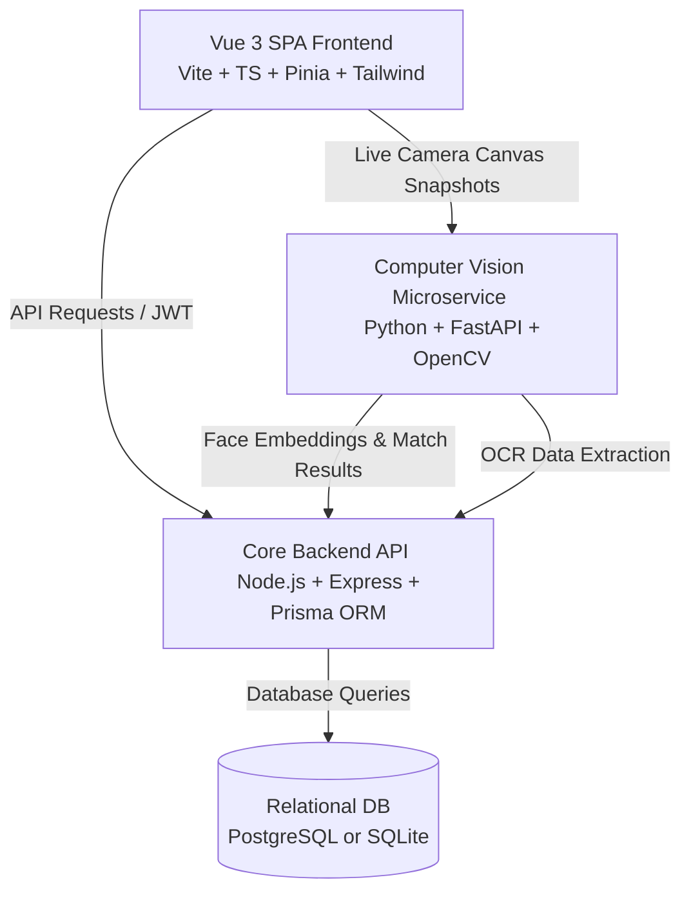
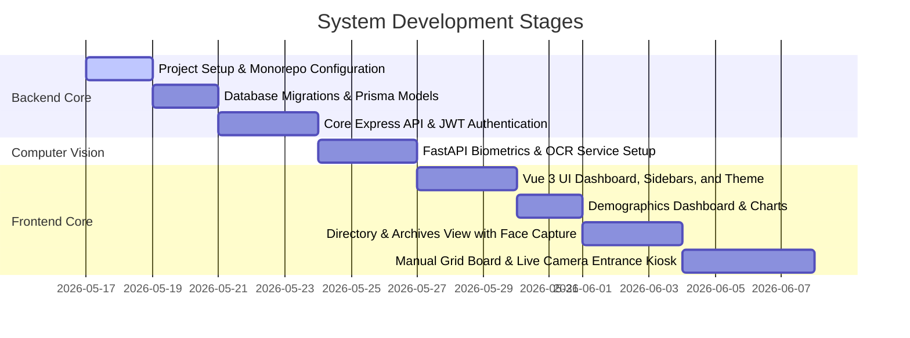

# Architectural Design & Implementation Plan: Church Monitoring & Attendance System

This document outlines a complete, production-grade architectural design and a step-by-step **Prompt Plan** for building the **Church Membership & Attendance Monitoring System**. The design is meticulously crafted to digitize and elevate the manual spreadsheet tracking systems captured in your screenshots, transforming them into a premium, state-of-the-art web application.

---

## 📐 High-Level Architecture Overview

To achieve an elite user experience (smooth animations, mobile responsiveness, fast load times) while simultaneously offering robust, cutting-edge biometric facial recognition and barcode ID scanning, we will use a **hybrid, microservice-based architecture**:



### Why This Hybrid Architecture Wins:
1. **Frontend (Vue 3 + Vite + Tailwind CSS):** A standard Python frontend (like Streamlit, NiceGUI, or PySimpleGUI) lacks the high-end design aesthetics, responsiveness, and fluid micro-animations required to *wow* users. Vue 3 delivers a premium, app-like experience perfect for both church administrators on desktops and ushers using tablets at the sanctuary gates.
2. **Core Backend (Node.js + Prisma ORM):** Prisma is a highly developer-friendly, type-safe database mapping layer. Combined with Node.js, it handles REST APIs, robust JWT authentication, complex membership queries, and exports extremely fast.
3. **AI & Biometrics Microservice (Python + FastAPI):** Facial recognition (`face_recognition`, `OpenCV`, `InsightFace`) and ID scanning/OCR (`EasyOCR`, `Tesseract`) are natively supported and optimized in Python. We expose a lightweight FastAPI service that acts as a secure "AI engine." The Vue frontend captures video frames, streams them to the Python service for processing, and passes results to the Core Node.js backend.

---

## 🗄️ Database Design (Prisma Schema)

Our schema captures all custom metrics shown in your spreadsheets:
- **Demographics & Categories:** Fathers, Mothers, Youth (Kabataan), Adults (Katandaan), Seniors, and Widows/Widowers (Bao).
- **Locations & Statuses:** Barangay tracking (Lambac, Natividad, Ebus, Pulungmasle, Magsaysay, Fortuna, Dau, Sasmuan, Bacolor), Income Levels, and status life cycles (Active, On & Off, Suspended, Inactive, Missing, ODT, RFA, Archived).
- **Celebrants Calendar:** Birthdays and Baptism anniversaries, with active ("In Flesh") and memorialized ("In Spirit") tags.
- **Attendance Columns:** PM (Prayer Meeting), WS (Worship Service), and TG (Thanksgiving) sessions.

---

# 🚀 The Step-by-Step Prompt Plan
This plan contains **8 highly descriptive, sequential prompts** that you can feed into an AI coder (like Antigravity or any modern LLM) to build the entire system from scratch.

---

## 📋 Table of Contents
1. [Prompt 1: Project Initialization & Environment Setup](#prompt-1-project-initialization--environment-setup)
2. [Prompt 2: Database Schema Definition & Prisma Setup](#prompt-2-database-schema-definition--prisma-setup)
3. [Prompt 3: Core Node.js Backend & JWT Authentication](#prompt-3-core-nodejs-backend--jwt-authentication)
4. [Prompt 4: Python FastAPI Biometric & OCR Microservice](#prompt-4-python-fastapi-biometric--ocr-microservice)
5. [Prompt 5: Vue 3 Frontend Layout, Theme & Styling Foundation](#prompt-5-vue-3-frontend-layout-theme--styling-foundation)
6. [Prompt 6: Real-time Demographic Dashboard & Celebrants Calendar](#prompt-6-real-time-demographic-dashboard--celebrants-calendar)
7. [Prompt 7: Membership Directory & Status Archive Manager](#prompt-7-membership-directory--status-archive-manager)
8. [Prompt 8: Attendance Matrix Board & Facial Recognition Kiosk](#prompt-8-attendance-matrix-board--facial-recognition-kiosk)

---

### Prompt 1: Project Initialization & Environment Setup
> [!IMPORTANT]
> **Goal:** Create the clean workspace structure, initialize Vue 3, Node.js, and FastAPI projects, and configure cross-origin settings.

```markdown
Create the baseline directory structure and config files for our Church Monitoring & Attendance System. 
The system consists of three modules residing in a single monorepo:
1. `frontend/` - Vue 3, Vite, Tailwind CSS, Pinia, Vue Router, TypeScript.
2. `backend/` - Node.js, Express, Prisma ORM, TypeScript.
3. `ai-service/` - Python, FastAPI, OpenCV, face_recognition, Uvicorn.

Please perform the following initialization steps:
- Initialize the root workspace configurations.
- Inside `backend/`, set up a package.json, tsconfig.json, install express, cors, dotenv, helmet, prisma, @prisma/client, bcryptjs, jsonwebtoken, and their corresponding @types.
- Inside `frontend/`, run Vite initialization for a Vue 3 + TypeScript template. Configure Tailwind CSS v3/v4 with custom CSS, install lucide-vue-next (for premium icons), pinia, and vue-router. Add a premium dark-mode custom-tailored theme in tailwind.config.js using a color palette of Deep Indigo, Teal Accent, Rose/Ruby (for inactive/archived states), and Slate Neutrals.
- Inside `ai-service/`, create a standard Python virtual environment structure, a requirements.txt with: fastapi, uvicorn, opencv-python-headless, face-recognition, numpy, easyocr, and python-multipart.

Provide the exact folder layout, system configuration files (e.g. vite.config.ts, tailwind.config.js, tsconfig.json, requirements.txt, .env.example files), and write a bootstrap shell/powershell script to install dependencies in all three folders.
```

---

### Prompt 2: Database Schema Definition & Prisma Setup
> [!NOTE]
> **Goal:** Build the complete database relational schema using Prisma, fully representing all columns and statuses from the spreadsheet files with advanced flexibility for groups, multiple addresses, custom session types, and clean user roles.

```markdown
Define the complete database schema for our Church Monitoring system using Prisma ORM. The schema must fully support PostgreSQL and SQLite (with fallback) and model the complex demographic variables from our church registry.

Please write the `prisma/schema.prisma` file containing:
1. **User Model (Staff/Admins):**
   - id (UUID)
   - username, email, passwordHash
   - role (Enum: SUPER_ADMIN, ELDER, OFFICER, MEMBER)
   - createdAt, updatedAt

2. **Member Model:**
   - id (UUID)
   - publicId (String, unique, e.g. 'M130200150' - Church ID)
   - lastName, firstName, middleName, alias
   - status (Enum: ACTIVE, ON_AND_OFF, SUSPENDED_ACTIVE, SUSPENDED_ON_AND_OFF, INACTIVE, MISSING, ODT, RFA, ARCHIVED)
   - gender (Enum: MALE, FEMALE)
   - civilStatus (Enum: SINGLE, MARRIED, WIDOWED, DIVORCED)
   - hasChildren (Boolean, default false)
   - birthdate (DateTime)
   - dateOfBaptism (DateTime, nullable)
   - contactNumber (String, nullable)
   - incomeLevel (Enum: LOW, MIDDLE, HIGH, default LOW)
   - isDeceased (Boolean, default false - represents "In Spirit" members)
   - groupId (UUID, nullable)
   - createdAt, updatedAt
   - Relations: 
     - group (belongs to Group: field groupId references Group.id)
     - ledGroups (has many led groups: references Group.leaderId)
     - addresses (has many MemberAddress relations)
     - attendanceRecords (has many AttendanceRecord)
     - faceEmbedding (has one FaceEmbedding)

3. **Address Model:**
   - id (UUID)
   - streetAddress (String, nullable)
   - barangay (String, e.g. 'Lambac', 'Natividad', 'Ebus', 'Pulungmasle', 'Magsaysay', 'Fortuna', 'Dau', 'Sasmuan', 'Bacolor')
   - municipality (String, default 'Guagua')
   - province (String, default 'Pampanga')
   - zipCode (String, nullable)
   - Relations: memberAddresses (has many MemberAddress relations)

4. **MemberAddress Model (Junction Table):**
   - id (UUID)
   - memberId (UUID, references Member)
   - addressId (UUID, references Address)
   - addressType (Enum: PRIMARY, SECONDARY, BUSINESS, default PRIMARY)
   - Relations:
     - member (references Member.id with Cascade delete)
     - address (references Address.id with Cascade delete)
   - Constraints: unique compound index on (memberId, addressId)

5. **Group Model (Grace Cell / Cell Group):**
   - id (UUID)
   - groupName (String, unique)
   - leaderId (UUID, nullable, unique)
   - Relations:
     - leader (references Member.id - leads the cell group)
     - members (has many Member relations who belong to this cell group)

6. **SessionType Model (Custom Session Types Table):**
   - id (UUID)
   - name (String, unique: e.g. 'Worship Service', 'Prayer Meeting', 'Thanksgiving', 'Youth Service')
   - shortName (String, unique: e.g. 'WS', 'PM', 'TG', 'YS')
   - description (String, nullable)
   - createdAt, updatedAt
   - Relations: sessions (has many AttendanceSession relations)

7. **AttendanceSession Model:**
   - id (UUID)
   - date (DateTime)
   - name (String, e.g. 'WS - April 4, 2026')
   - sessionTypeId (UUID, references SessionType)
   - isLocked (Boolean, default false)
   - Relations: 
     - sessionType (references SessionType.id)
     - records (has many AttendanceRecord)

8. **FaceEmbedding Model:**
   - id (UUID)
   - memberId (UUID, unique, references Member)
   - embeddingJson (String/Text: Stores the 128-dimensional floating point array from python face_recognition)
   - facePhotoUrl (String, nullable: path to registered member face profile)

9. **AttendanceRecord Model:**
   - id (UUID)
   - memberId (UUID, references Member)
   - sessionId (UUID, references AttendanceSession)
   - status (Enum: PRESENT, ABSENT, TRANSFERRED)
   - viaZoom (Boolean, default false)
   - method (Enum: BIOMETRIC, SCANNER, MANUAL, ZOOM)
   - markedAt (DateTime, default now)

Create the prisma schema file, a seeding script (`prisma/seed.ts`) that populates the database with realistic groups (with leaders), custom session types, addresses, and members matching the spreadsheet files (including Active, Inactive, Archived statuses, and Pampanga barangays linked to members), and explain how to run the migrations. Ensure that recursive relations between Member and Group are clearly marked with custom relation names (`@relation("GroupMembers")` and `@relation("GroupLeader")`) to prevent cyclic dependency runtime issues.
```

---

### Prompt 3: Core Node.js Backend & JWT Authentication
> [!IMPORTANT]
> **Goal:** Create a robust, secure REST API in Express that handles JWT Auth (with updated roles), member CRUD, custom address association, group leadership mapping, and batch attendance uploads.

```markdown
Write the core Express backend endpoints in TypeScript for the Church System. Make sure the backend features premium patterns: structured controller/service layers, input validation using Zod or custom validator middlewares, error handlers, and security headers.

Implement the following endpoints:
1. **Authentication API:**
   - POST `/api/auth/login` (Returns JWT with role-based access controls for: SUPER_ADMIN, ELDER, OFFICER, MEMBER)
   - POST `/api/auth/register` (Protected, only SUPER_ADMIN or ELDER can create system operators)
   
2. **Membership CRUD & Relational API:**
   - GET `/api/members` (With sorting, pagination, search query, and filters for Barangay - via MemberAddress, Group, Status, Gender, and isDeceased)
   - GET `/api/members/:id` (Returns full profiles including linked Addresses and Group information)
   - POST `/api/members` (Validates fields, supports linking a member to a Group via `groupId` and creating primary/secondary Addresses in a transactional query)
   - PUT `/api/members/:id` (Updating details, assigning group membership, updating address associations, status transitions, or archiving)
   - DELETE `/api/members/:id` (Soft-delete or archive)

3. **Addresses & Group Management API:**
   - GET `/api/groups` (List all cell groups along with their leader details and total member counts)
   - POST `/api/groups` (Create a new cell group, optionally linking a `leaderId` from the Member table)
   - PUT `/api/groups/:id` (Update cell group name or leadership)
   - POST `/api/members/:id/addresses` (Associate a new Address to a member: creates the Address and junction MemberAddress record)

4. **Dynamic Session Types & Attendance API:**
   - GET `/api/session-types` (List all manually registered custom session types)
   - POST `/api/session-types` (Admin endpoint to dynamically add new session types like 'Youth Service', 'Dawn Prayer', etc.)
   - POST `/api/attendance/sessions` (Create a session for a specific date, linking to a valid `sessionTypeId`)
   - GET `/api/attendance/matrix` (Returns a full attendance grid board for a month: members, list of sessions, and checkmark states for each member, querying primary barangays and groups for UI grouping)
   - POST `/api/attendance/toggle` (Toggles a checkmark: checks/unchecks a member for a session, updating or creating an AttendanceRecord)
   - POST `/api/attendance/import-excel` (Accepts an uploaded `.xlsx` attendance grid file. Parses headers starting from Row 1 for dates and Row 2 for Session Types like PM, WS, TG. Cleans and matches names in Column A—stripping prefixes like "B. " or "S. "—against Member aliases/names. Returns parsed dates, mapped records, and a list of unmatched names for frontend resolution)
   - POST `/api/attendance/confirm-import` (Transactionally saves the imported attendance session records and checkmark states once unmatched member mappings are approved by the operator)
   
5. **Biometric Integration Endpoints:**
   - POST `/api/members/:id/biometrics` (Receives face embedding from Python microservice and stores it in FaceEmbedding database)
   - POST `/api/attendance/biometric-verify` (Receives a recognized member ID from Python kiosk camera, records attendance instantly as PRESENT with method 'BIOMETRIC')

Provide the full backend route controllers, middlewares, routes, and main server configuration file, optimized for high speed.
```

---

### Prompt 4: Python FastAPI Biometric & OCR Microservice
> [!TIP]
> **Goal:** Develop the Python computer vision microservice. It registers face embeddings, matches faces, and scans ID cards to extract Member text details.

```markdown
Develop the Python FastAPI microservice (`ai-service`) that handles all facial recognition and OCR tasks. This service acts as an auxiliary processor. It will not write directly to the database, but instead parse images, perform heavy AI operations, and return structured JSON payloads to our main Express API.

Provide the complete `main.py` containing:
1. **Face Enrollment Endpoint (`POST /enroll`)**:
   - Accepts a raw face image (via file upload or Base64).
   - Uses OpenCV to load/align the face.
   - Uses the `face_recognition` library to extract the 128-dimensional floating point face embedding.
   - Returns the embedding as a float list.

2. **Face Recognition Verification Endpoint (`POST /recognize`)**:
   - Accepts a captured camera frame (Base64) from the Vue kiosk, along with a list of active registered member embeddings (`[{member_id: "...", embedding: [...]}]`).
   - Computes the embedding of the incoming frame.
   - Uses `face_recognition.compare_faces` and `face_recognition.face_distance` with an adjustable threshold (default 0.6) to find the best match.
   - Returns the matched `member_id`, similarity confidence, and bounding box coordinates, or `null` if unrecognized.

3. **ID Scanning OCR Endpoint (`POST /scan-id`)**:
   - Accepts an image upload of the Member's ID Card.
   - Applies OpenCV filters (grayscale, thresholding, deskewing) to optimize OCR readability.
   - Uses `EasyOCR` or PyTesseract to extract text fields.
   - Uses Regex/pattern matching to search for: "Last Name", "First Name", "Middle Name", and "PUBLIC ID" (e.g., M130200150).
   - Returns a structured JSON of extracted fields.

Include setup instructions for Python environment, local testing files with curl requests, and an elegant handler for handling edge cases (like low light, blur, or no faces found).
```

---

### Prompt 5: Vue 3 Frontend Layout, Theme & Styling Foundation
> [!NOTE]
> **Goal:** Set up a luxury dashboard design system in Vue 3, including custom layouts, responsive sidebars, alerts, and navigation routers.

```markdown
Design the core UI styling system and base layout wrapper for the Vue 3 application. The application must look stunning, premium, and extremely modern—using a deep slate dark mode as default, combined with rich HSL colors (Teal/Indigo gradients, bright emerald success highlights, ruby/crimson warnings, and amber warnings for suspended states). Avoid plain colors and default tables.

Please write the following files:
1. `src/index.css`: Setup standard modern CSS. Configure custom scrollbars, global gradient background, glassmorphism card panels (`backdrop-filter blur-md border border-white/10 bg-slate-900/60`), custom hover micro-animations, and dynamic transition variables.
2. `src/router/index.ts`: Configures paths for:
   - `/login` (Glassmorphism layout)
   - `/` (Main Dashboard)
   - `/directory` (Membership Table & Archives)
   - `/attendance` (Manual Grid Board Matrix)
   - `/kiosk` (Attendance terminal: Facial/ID Scan screen)
3. `src/layouts/AppLayout.vue`: A beautiful, premium shell containing:
   - Left Sidebar: Custom links, gorgeous glowing icons (Lucide-vue), collapsible panel, and Profile section (Name, Role badge).
   - Header Bar: Global search bar, dynamic Quick Actions button, dark/light toggle, and System Connection Status indicators (Main DB, Python AI Service).
4. `src/stores/auth.ts`: Pinia store mapping login status, JWT token management, and checking client routing permissions.

Provide complete vue template code and standard CSS files. Ensure the design looks highly polished, clean, and resembles premium dashboard systems.
```

---

### Prompt 6: Real-time Demographic Dashboard & Celebrants Calendar
> [!TIP]
> **Goal:** Replicate the demographic dashboards from Image 2 in a gorgeous grid of charts, trackers, and cards.

```markdown
Create the central Dashboard component (`src/views/Dashboard.vue`) in Vue 3 that aggregates all metadata and demographics visible in our Excel spreadsheets. 

Build a stunning, responsive layout containing:
1. **High-Impact Stat Cards:**
   - Grand Total Members (glowing blue counter).
   - Active, Suspended, Inactive, and Archived count cards using consistent semantic indicator colors.
2. **Interactive Demographic Grid:**
   - A modern, custom visual table dividing Male vs Female across Age Groups: Senior, Katandaan (Adults), and Kabataan (Youth), displaying exact tallies and percentages.
   - Barangay Breakdown: A horizontal bar chart or progressive list showing membership density by Barangay (Lambac, Natividad, Sasmuan, etc.).
   - Income & Civil Status distribution indicators.
3. **Celebrants Calendar Widget (May - September):**
   - Renders a clean grid separating Birthdays and Baptism Anniversaries.
   - Group them dynamically into two tabs/sections: **"In Flesh" (Living Members)** and **"In Spirit" (Deceased/Memorialized Members)** as shown in our spreadsheet. Shows age milestones (e.g. "S. Lydia L - 66th Birthday today").
4. **System Status Overview:**
   - Shows active connections to local hardware camera, barcode scanner, and AI core backend.

Write this component using Vite, Tailwind CSS, TypeScript, and standard charting libraries (or lightweight CSS progress bars/SVG graphs for premium visual speed). Do not use placeholders.
```

---

### Prompt 7: Membership Directory & Status Archive Manager
> [!NOTE]
> **Goal:** Replicate the database view (Image 3) and Archive view (Image 4) into a powerful, filterable data table with inline editing.

```markdown
Develop the core Directory Component (`src/views/Directory.vue`) in Vue 3. This view will replace our manual "Active DB" and "Archived" spreadsheet sheets with a single, high-performance membership database application.

Provide a comprehensive implementation including:
1. **Interactive Search & Filter Header:**
   - Real-time search by Name, Alias, or Public ID.
   - Dropdown selectors for Barangay, Group Name (GC), Gender, Civil Status, and Status.
   - Dedicated toggle for "Archived / Deceased (In Spirit)" members.
2. **The Modern Data Table:**
   - Custom column layouts representing all fields from Image 3: Public ID, Full Name, Alias, Barangay, Age, Status (with custom colored pill badges), Civil Status, Baptism Date, and Contact Number.
   - Hover effects, sorting indicators, and smooth pagination.
3. **Member Profile Modal:**
   - Deep-dive card for a single member showing complete metrics: Has Children, Income Level, Years in Church.
   - **Face Enrollment Wizard:** Camera feed box that captures their photo, sends it to `/api/members/:id/biometrics`, and prints "Face Embedding Registered Successfully" with green ticks once the Python service parses it.
4. **Action Triggers:**
   - Quick edit status button (Transition active -> inactive, suspended, or archive).
   - "Export to Excel/PDF" utility button.
   - "Scan ID Card to Add Member" button: Opens camera scanner, calls OCR API, and pre-fills the new member form automatically.

Use Vue 3 `<script setup lang="ts">`, Pinia for directory state management, and clear UI design with smooth transitions.
```

---

### Prompt 8: Attendance Matrix Board & Facial Recognition Kiosk
> [!IMPORTANT]
> **Goal:** Replicate the matrix checklist (Image 1) and create the real-time biometric and barcode scanning terminal.

```markdown
Implement the core Attendance Modules in Vue 3. This includes two high-priority screens:

### Screen A: Manual Attendance Matrix (`src/views/AttendanceMatrix.vue`)
- A direct modernization of our spreadsheet matrix (Image 1).
- Shows a list of members in rows, and dates/sessions in columns (divided into PM - Prayer Meeting, WS - Worship Service, TG - Thanksgiving).
- Cells are interactive checkmark toggles. Clicking a cell triggers backend update via `/api/attendance/toggle` to toggle attendance between PRESENT, ABSENT, or TRANSFERRED.
- Dynamic totals on the right: "Present (Days)" and "Absent (Days)" that auto-recalculate instantly.
- Toggle switch to show/hide "Inactive/Archived" members from the grid.
- **Excel/Spreadsheet Attendance Import Wizard Modal:**
  - Includes a prominent "Import Attendance Sheet" button opening a custom, dark glassmorphic wizard modal.
  - Supports drag-and-drop upload of the church's attendance `.xlsx` files.
  - Displays a visual preview of extracted session columns (Dates mapped to Session Types: PM, WS, TG) and mapped members.
  - Provides a **Name Mapper Interface** for unresolved names: lists any sheet names not matched automatically (e.g. showing spelling variations) alongside a search-and-select dropdown to quickly bind them to actual Member profiles or toggle a "Create New Member" fast-track form.
  - Displays a pre-flight summary screen detailing the changes (e.g., "Ready to write 12 sessions and 640 attendance points. 23 name corrections applied").
  - Sends final approved mapping variables to the backend `/api/attendance/confirm-import` endpoint, instantly refreshing the matrix board with smooth state animations.

### Screen B: The Attendance Entrance Kiosk (`src/views/AttendanceKiosk.vue`)
- A full-screen, dedicated tablet/kiosk dashboard for church entrances.
- Includes a toggle for **"Biometric (Face) Recognition Mode"** and **"ID Card Scan Mode"**:
  1. **Face Recognition Mode:**
     - Live HTML5 video feed box with canvas overlay drawing target facial guide contours.
     - Automatically grabs snapshots every 1.5 seconds, converts them to Base64, and sends them to our Python server to run comparative math against enrolled faces.
     - When verified, triggers a gorgeous, temporary overlay alert: **"Welcome, Sister Rachel T!"** (Plays a subtle sound, prints their Photo, Barangay, and a Success Banner for 3 seconds, then fades back to waiting state).
  2. **ID Barcode/QR Scan Mode:**
     - Captures barcode or QR ID numbers.
     - Instantly verifies ID against the `PUBLIC ID` database, checks the member in, and sounds a validation chime.
- Visual indicator showing live network ping, frame rates, and scanner connectivity.

Provide the complete Vue components with native camera stream integration (`navigator.mediaDevices.getUserMedia`), visual cues, state storage, and dynamic feedback layouts.
```

---

## 🛠️ Step-by-Step Execution Guide

When working with an AI developer to build this application, use this workflow:



### Tips for Execution:
1. **Run locally:** Place the directories side-by-side. Run the AI server on `localhost:8000`, the Node Express API on `localhost:5000`, and the Vue client on `localhost:5173`.
2. **Camera Permissions:** Ensure your local host uses HTTPS or runs on localhost, otherwise browsers will block `getUserMedia` camera access for the kiosk face recognition and ID scanning.
3. **Database Selection:** For a standard local church with up to 10,000 members, **SQLite** or a local **PostgreSQL** instance is perfect and completely free.
